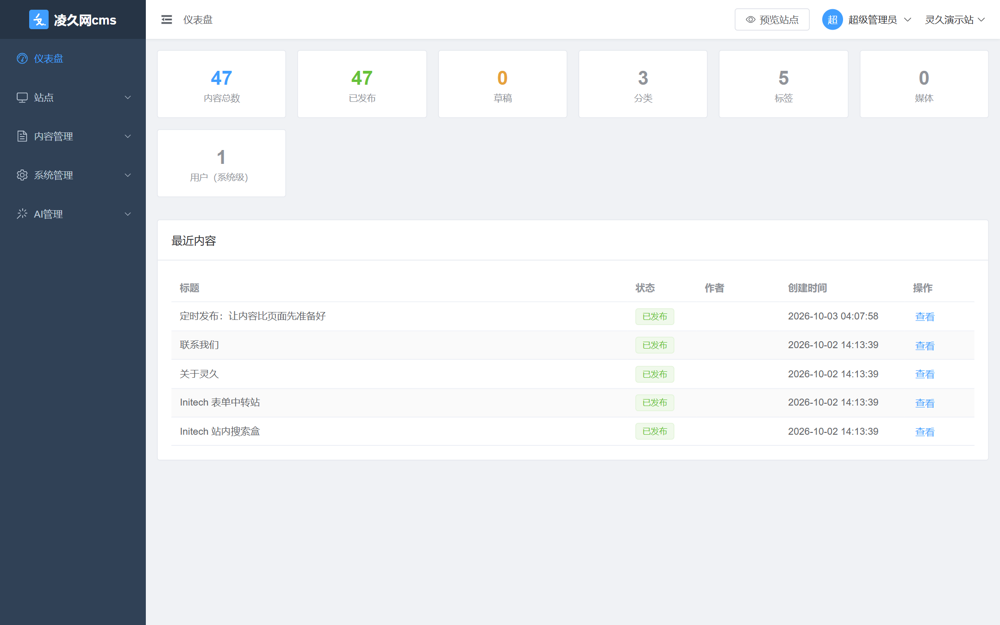
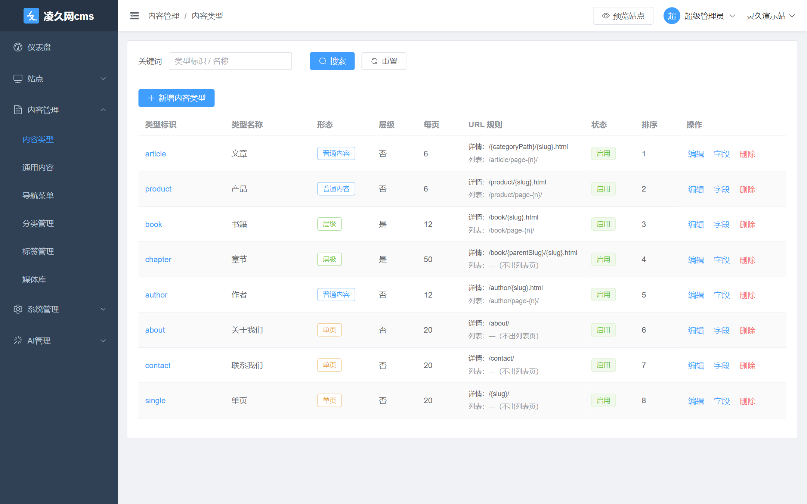
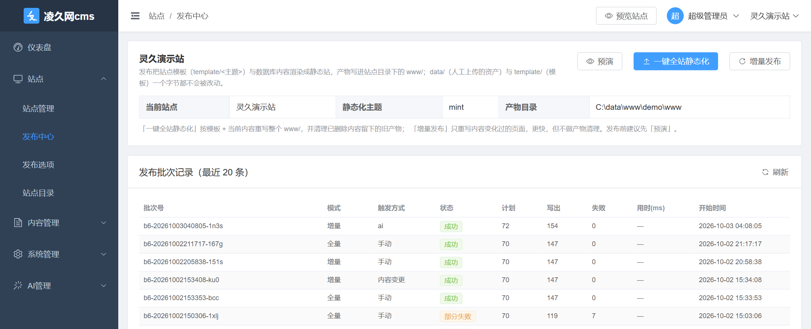
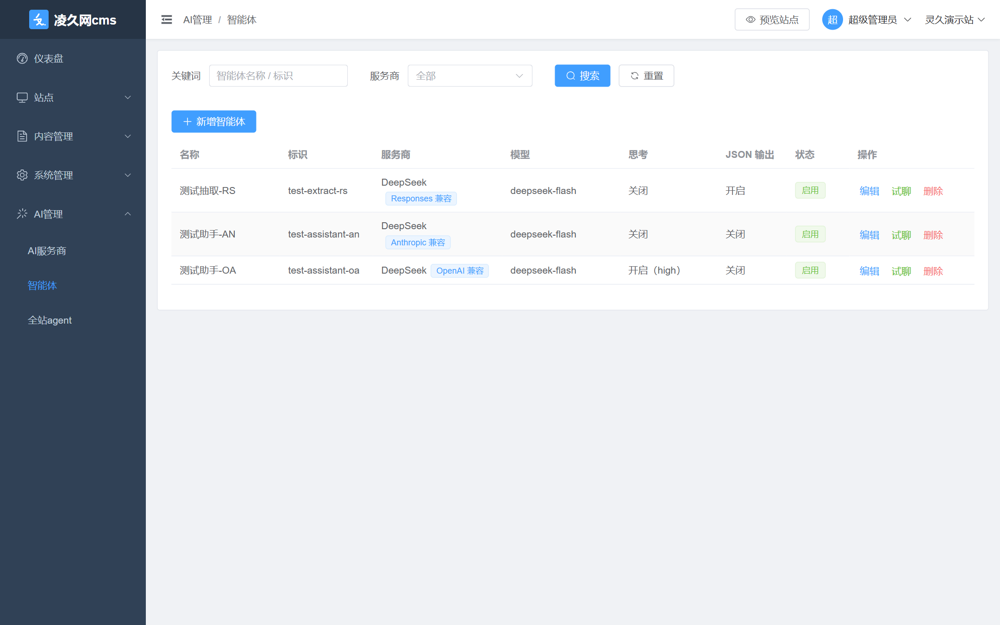

# Lingjiuw CMS — Enterprise Content Management Scaffold

[简体中文](README.md) | English

[](https://github.com/FiteNine/lingjiu_cms/actions/workflows/ci.yml)
[](LICENSE)
[](#tech-stack)
[](#tech-stack)
[](https://github.com/FiteNine/lingjiu_cms/stargazers)

A Java 21 + Spring Boot 3.5 + Vue 3 CMS scaffold: the admin console, REST API, static-publishing engine and an AI agent
all live in **one JAR**. Three things set it apart from a plain admin template — **content structure is defined in the
database** (not hard-coded tables), **sites are rendered static output** (not a database query per request), and
**the console ships an AI agent that operates the CMS itself**.



## Run It in 30 Seconds

```bash
git clone https://github.com/FiteNine/lingjiu_cms.git && cd lingjiu_cms
export CMS_JWT_SECRET=$(openssl rand -base64 32)
docker compose up -d --build
```

Open <http://localhost:8081/> and sign in with `admin / admin123`. The first build installs dependencies and compiles
frontend and backend (about 3–5 minutes); later starts take seconds. No Docker? Use the source path in
[Quick Start](#quick-start).

> If port 5432 is already taken by another PostgreSQL the compose stack will not start: run
> `docker compose up -d postgres` for the database only, or drop the published port in `docker-compose.yml`
> (the application reaches Postgres over the compose network, no host port needed).

## What Makes It Different

| | |
| --- | --- |
| Content structure is data, not code | Content types (plain / single page / hierarchical, URL rules, list and detail templates, SEO fields) and field definitions (19 field types) work the moment you create them in the console; form controls, list columns and `where` / `orderby` / `facet` are all driven by those definitions. An article is just the built-in `article` type — there is no separate article table |
| Sites are rendered static output | "One-click full-site static publishing" renders `template/<theme>/` plus database content into a ready-to-host static site under the site's `www/`, along with sitemap / feed / robots / search index / `cms-site.json`. Dry-run the batch first, then keep the batch records and per-page failure details |
| An AI agent inside the console | The tool layer follows MCP Tool semantics: it can query content, change categories and check publish state. Every action is bounded by the logged-in user's permissions, and destructive ones ask for confirmation |
| A very small deployment surface | The admin UI is packaged into Spring Boot's static resources — `java -jar` is the whole thing. No Redis, no Nginx, no second service |
| It is tested | 584 test cases (including real-database cases) run on every push: migrations are applied from scratch to an empty database first, then the whole suite runs |

**Dynamic modelling**: content types and field definitions are usable the moment you create them; 19 field types.



**One-click full-site static publishing**: templates + database content → a ready-to-host static site; batches, failure details and incremental publishing all live on this page.



**AI management**: one agent configuration adapts to the OpenAI / Anthropic / Responses protocols.



## Contents

[Run It in 30 Seconds](#run-it-in-30-seconds) · [What Makes It Different](#what-makes-it-different) · [Tech Stack](#tech-stack) ·
[Directory Structure](#directory-structure) · [Quick Start](#quick-start) · [Feature List](#feature-list) · [Multi-site](#multi-site) ·
[AI Module](#ai-module-providers--agents) · [API Conventions](#api-conventions) · [Permission Model](#permission-model-rbac) ·
[Common Configuration](#common-configuration) · [Steps to Add a Business Module](#steps-to-add-a-business-module) ·
[Design Trade-offs](#design-trade-offs-deliberately-out-of-scope-for-now) · [API Overview](#api-overview-main-endpoints) · [License](#license)

**The admin console and the CMS are bound together**: start one Spring Boot process and open `http://localhost:8081/` in a browser for the admin console; the REST API lives under `/api/**` and the API docs at `/swagger-ui.html`. The frontend build output is packaged directly into Spring Boot's static resource directory — no Nginx, no second service.

## Tech Stack

| Layer | Choice |
| --- | --- |
| Language / Runtime | Java 21 (LTS) |
| Framework | Spring Boot 3.5.x (Web / Validation / Security / AOP) |
| ORM | MyBatis-Plus 3.5.x (pagination plugin + auto-filled audit fields + logical delete) |
| Database | PostgreSQL 16 (Flyway versioned migrations) |
| Authentication | Spring Security + JWT (jjwt, HS256, stateless) |
| API Docs | springdoc-openapi 2.8.x (Swagger UI) |
| Frontend | Vue 3.5 + TypeScript + Vite + Element Plus + Pinia + Vue Router + Axios |
| Rich text | wangEditor 5 |
| Build | Maven 3.9+ / npm |

## Directory Structure

```
backend/
├── pom.xml                      # Maven build
├── Dockerfile                   # Multi-stage build: frontend → backend → runtime image
├── docker-compose.yml           # One command for PostgreSQL 16 + the application (database only: docker compose up -d postgres)
├── .github/workflows/ci.yml     # CI: migrations from scratch on an empty database + unit and real-database tests
├── admin-ui/                    # Admin frontend (Vue3 + Element Plus)
│   └── vite.config.ts           # Build output goes to src/main/resources/static
├── src/main/java/com/lingjiuw/cms/
│   ├── common/                  # Unified response, exceptions, JWT, Security, MyBatis-Plus config
│   ├── config/                  # Web / SPA fallback / Swagger / Jackson config
│   ├── annotation/ + aspect/    # @OperLog operation-log aspect
│   └── module/
│       ├── system/              # System: login, users, roles, menus, dictionaries, operation logs
│       ├── cms/                 # Content: sites, categories, tags, contents, media, stats, public API
│       └── ai/                  # AI: providers (three protocol adapters), agent config and trial chat
├── src/main/resources/
│   ├── application.yml
│   ├── db/migration/            # Flyway: V1 schema, V2 seed data
│   └── static/                  # Frontend build output (generated by npm run build, not committed)
├── uploads/                     # Media upload directory (created at runtime)
└── sites/                       # Root of the site directories: every directory selected/created in
                                 #   Site Management lives under it (created at runtime); each site
                                 #   directory always has data/ (static assets) and template/ (site templates)
```

## Quick Start

> **Just want to see it running?** Use [Run It in 30 Seconds](#run-it-in-30-seconds) — no JDK, Node or PostgreSQL
> needed. What follows is the from-source path, which is what you want while changing code.

### 1. Prerequisites

- JDK 21, Maven 3.9+
- Node 20+ (to build the admin frontend)
- PostgreSQL 16 (an existing instance, or Docker)

### 2. Prepare the database (pick one)

**A. Reuse an existing PostgreSQL 16 instance** (the way this repository's dev machine does it):

```bash
docker exec -it <your-pg16-container> psql -U postgres
```

```sql
create user cms with password 'cms123456';
create database lingjiuw_cms owner cms;
```

**B. Bring up a dedicated instance with the bundled compose file** (recommended on a new machine):

```bash
cd backend
docker compose up -d     # postgres:16, port 5432, database/user match application.yml
```

Connection settings live in `src/main/resources/application.yml`; either edit the file or override with environment variables:

```bash
SPRING_DATASOURCE_URL=jdbc:postgresql://localhost:5432/lingjiuw_cms
SPRING_DATASOURCE_USERNAME=cms
SPRING_DATASOURCE_PASSWORD=cms123456
```

### 3. Build the admin frontend

```bash
cd backend/admin-ui
npm install
npm run build            # output goes to backend/src/main/resources/static
```

### 4. Start it

```bash
cd backend
mvn spring-boot:run
# or package and run: mvn -DskipTests package && java -jar target/lingjiuw-cms-1.0.0.jar
```

The first start runs the Flyway migrations automatically (schema + seed data).

### 5. Open it

| Entry point | URL |
| --- | --- |
| Admin console | http://localhost:8081/ |
| Swagger API docs | http://localhost:8081/swagger-ui.html |
| Public content API | http://localhost:8081/api/public/articles |
| Default account | `admin / admin123` (change it in production) |

> If the port is taken (e.g. 8080 is used by Jenkins on this machine), change `server.port` in `application.yml` and update the proxy target in `admin-ui/vite.config.ts` accordingly.

### 6. Frontend dev mode (optional)

```bash
cd backend/admin-ui
npm run dev              # http://localhost:5173, /api and /uploads proxy to 8081
```

## Feature List

| Module | Features |
| --- | --- |
| Authentication | Login (JWT), current user, change password, logout |
| System | Users (role assignment, site authorization / password reset / disable), roles (menu permission assignment), menus (directory / menu / button), dictionaries (types + items), operation logs (recorded automatically) |
| Content management | Categories (tree), tags, generic contents (draft/publish/offline, sticky, featured, category, tags, cover, rich text), media library (local upload), dashboard stats |
| Dynamic modeling | **Content types** (generic/single-page/hierarchical, URL rules, detail and list templates, pagination, SEO fields, jsonb options), **field definitions** (19 field types, index/search/raw-output switches, ENUM options, ordering) |
| Generic contents | **The single entry point for all content, and the table the engine actually renders**: pagination by type, dynamic field forms (controls generated from field definitions), body (rich text/Markdown), category/tags/sticky/featured, publish/offline; on save it **rebuilds the field index table and category/tag relations in the same transaction** (`where` / `orderby` / `facet` only read the index table). An article is the built-in type `article`; there is no separate article table any more |
| Navigation menus | CRUD for site navigation (`cms_menu` / `cms_menu_item`) menus and menu-item trees, with 8 menu-item types (category/content/link/type/tag/archive/placeholder/author). Note this is not the same thing as the system menu `sys_menu` |
| Site publishing | **One-click full-site static generation** (preview → publish → batch record), **preview site** (serve the published `www/` as-is on a read-only port), **publish options** (site-level key/value config including `url.*` / `page.*` / `seo.*` / `pages.static` plus site-defined entries), theme list and switching |
| Site management | Site config (name/identifier/domain/Logo/description/SEO keywords and description/ICP filing number/contact/**language/protocol/theme/OG image/default cover/analytics code**/status), site directories (browse and create folders inside the configured root; saving a site automatically creates the `data` (site static assets) and `template` (site templates) subdirectories) |
| Site directory | Browse the website file directory of the current site (the one selected in the switcher, top right): file tree on the left, click a file to edit or preview it on the right; text files are read/written as UTF-8 and saved, images preview as data URLs, other types only show file info. Entry: `Site → Site Directory` |
| Multi-site | The system ships with a built-in "default site"; the switcher at the top right switches sites (listing only the sites the current user is authorized for), and categories/tags/contents/media/stats are all isolated per site |
| AI | Providers (three protocols, API key masking, connectivity test), agents (model parameters, system prompt, thinking mode, trial chat) |
| Public API | Paginated published articles / article detail (by slug, reading contents of the built-in type `article`), category tree, contents of a given site by `siteId` — for portals/official sites to consume without logging in |

> **Static publishing**: in `Site → Publish Center`, "Preview" first computes which pages this batch
> would produce (without writing to disk), then "One-click full-site static generation" renders the
> templates under `sites/<site>/template/<theme>/` plus database contents into a directly hostable
> static site under `sites/<site>/www/`, along with sitemap / feed / robots / search index /
> `cms-site.json`. The contract is documented in
> [`docs/static-publish.md`](docs/static-publish.md).

## Multi-site

Several sites in one CMS, with content invisible across sites.

- **Default site**: the system always initializes one (`cms_site.is_default = 1`); any request that does not specify a site lands on it. The default site cannot be deleted; the database enforces the "at most one default site" invariant with `uk_cms_site_default`. Note that it is inserted directly by the migration, so its site directory (`cms.site.root-dir/default`) is only created the first time you save that site in "Site Management".
- **How the current site is resolved**: request header `X-Site-Id` (used by the switcher at the top right of the admin console) → request parameter `siteId` (used by the public API) → default site. Resolution is centralized in `common/site/SiteInterceptor`, and business code reads it via `SiteContext.siteId()`. If the site id cannot be resolved, or that site has already been deleted, it falls back to the default site — otherwise deleting the site you just switched to would leave the whole console erroring out.
- **What is isolated per site**: `cms_content` / `cms_category` / `cms_tag` / `cms_media`, each carrying a `site_id`. Users, roles, menus, dictionaries, operation logs, AI providers and agents are system-level and do not follow the site.
- **Unique constraints**: `slug` went from globally unique to **unique per site**, so two sites can each have a `news` category.
- **Deleting a site**: contents carry `site_id`, and once the site is gone those contents can never be identified again, so the default site cannot be deleted and neither can a site that still has contents.
- **Site access permissions**: `sys_user_site` binds "user → sites they may switch to", checked when editing a user in "User Management" (nothing selected = default site only). The switcher at the top right lists only the bound sites, and an `X-Site-Id` pointing at an unbound site falls back to the default site, so a stale site id on the frontend cannot wedge the console. The `admin` role is not restricted by bindings and sees every site; when all bound sites have been deleted it likewise falls back to the default site, so a missed binding never leaves a user without a usable site. The public API `/api/public/**` has no such restriction: portals can still read any site by `siteId`. The decision is centralized in `module/cms/service/SiteService#accessibleSiteIds`.
- **Not done yet**: site-level role permissions (e.g. "on this site you may publish articles but not change categories"). Site permissions currently stop at "which sites you can switch to"; what you may do once inside is still governed by menu permissions.

## AI Module (providers / agents)

Console entries: `AI Management → AI Providers`, `AI Management → Agents`.

| Protocol | Request | base_url example (DeepSeek) | Auth |
| --- | --- | --- | --- |
| `OPENAI` | `POST {base_url}/chat/completions` | `https://api.deepseek.com` | `Authorization: Bearer <key>` |
| `ANTHROPIC` | `POST {base_url}/v1/messages` | `https://api.deepseek.com/anthropic` | `x-api-key: <key>` |
| `RESPONSES` | `POST {base_url}/responses` | `https://api.deepseek.com` | `Authorization: Bearer <key>` |

- One `ai_provider` row = one provider × one protocol; the migration preloads three DeepSeek rows, and **the API key has to be filled in on the page**.
- Adding another provider: as long as it is compatible with one of the three protocols above, just add a row in "AI Providers" — no code change. For a genuinely new protocol, implement a `module/ai/protocol/AiProtocolClient` and let Spring pick it up automatically.
- The differences between the three protocols (thinking toggle and intensity, JSON output, where the system prompt goes, Anthropic's required `max_tokens`) are all contained in the protocol adapters, so agent configuration is protocol-agnostic.
- Deliberately left out: `frequency_penalty` / `presence_penalty` (officially deprecated, and passing them has no effect), and JSON output under the Anthropic protocol (that protocol has no equivalent parameter).
- Security boundaries: API keys are only ever returned masked (`sk-****8e3c`); leaving the field empty on edit means "do not change"; the `apiKey` in operation logs is masked automatically; a provider still referenced by an agent cannot be deleted.

The field basis for all three protocols comes from the official DeepSeek documentation.

## API Conventions

- Unified response envelope: `{ "code": 0, "message": "ok", "data": ... }`; `code = 0` means success, a business error has `code != 0` and a Chinese `message`
- Paged request `page` (1-based) / `size`; paged response `{ "records": [], "total": 0, "page": 1, "size": 20 }`
- Auth: `Authorization: Bearer <token>`; HTTP 401 when not logged in, HTTP 403 when not permitted
- Site: request header `X-Site-Id: <site id>` or request parameter `siteId`; omitting both means the default site (see "Multi-site")
- Time format: `yyyy-MM-dd HH:mm:ss`; Long ids are serialized as strings to avoid precision loss in frontend JS

## Permission Model (RBAC)

`sys_user` ↔ `sys_user_role` ↔ `sys_role` ↔ `sys_role_menu` ↔ `sys_menu`

- `sys_menu.perms` holds the permission string (e.g. `cms:content:add`), at button granularity
- Backend: `@PreAuthorize("hasAuthority('cms:content:add')")` on Controller methods
- Frontend: `v-permission="'cms:content:add'"` for button-level control (the `admin` role passes everything)
- Adding a permission point: insert a BUTTON record into `sys_menu` → tick it when assigning the role → add the directive to the frontend button
- Site access is separate from this: `sys_user_site` decides which sites a user can switch to, orthogonal to menu permissions (see "Multi-site")

## Common Configuration

| Setting | Default | Description |
| --- | --- | --- |
| `server.port` | `8081` | Service port (also serves the admin console pages) |
| `cms.jwt.secret` | — (required) | JWT secret; must be provided with the `CMS_JWT_SECRET` environment variable (≥32 bytes); startup fails if unset or too short |
| `cms.jwt.expire-hours` | `12` | Token lifetime (hours) |
| `cms.upload.dir` | `./uploads` | Media upload directory |
| `cms.upload.url-prefix` | `/uploads` | Media access URL prefix |
| `cms.site.root-dir` | `./sites` | Root of the site directory allowlist: a site's website file directory must be a subdirectory of it |
| `cms.preview.port` | `8090` | Port base for "Preview site": real port = base + site id (8096 for the demo site), listening on `127.0.0.1` only |

## Steps to Add a Business Module

1. Add `V3__xxx.sql` under `src/main/resources/db/migration/` (Flyway migrations are append-only)
2. Create entities under `module/<module>/entity` (keep the audit fields + `@TableLogic`) and a Mapper under `mapper`
3. Write the business logic in `service` (throw `BizException` and let the global handler turn it into the unified response), expose endpoints in `controller` with `@PreAuthorize` + `@OperLog`
4. Insert menu/button records into `sys_menu` and grant them to roles
5. Add pages under `admin-ui/src/views` and API wrappers under `src/api`

## Design Trade-offs (deliberately out of scope for now)

To keep the scaffold lean, the following capabilities have extension points but are not implemented:

- **Redis**: JWT is stateless, so no cache/blacklist; add one when forced logouts are needed
- **Object storage**: media is stored on the local disk for now; `cms_media.storage_type` already reserves `OSS`
- **Workflow/approval, comments, content revisions, recycle bin, scheduled publishing**
- **Dynamic menus**: frontend routes are statically defined, and `sys_menu` is mainly used for button-level permissions and authorization management; to generate menus per role, return the menu tree from `/api/auth/profile` and rework the frontend router
- **AI streaming output**: trial chat is non-streaming (one-shot response), no SSE; add it when a typewriter effect is needed
- **AI tool calling / knowledge base**: agents only configure model parameters and the system prompt; tools and RAG are not included
- **AI conversation persistence**: trial chat is a set of stateless endpoints, the conversation history is held by the frontend and not stored
- **Site file publishing**: the site directory page only edits text files that already exist on disk (no create, upload, delete or rename), and the CMS never publishes contents or media-library files into the site directory automatically; that step is still to come
- **Site-level content import/export / cross-site copying**: for now, switching sites in the top-right corner and maintaining each one separately is the only option

## API Overview (main endpoints)

```
POST   /api/auth/login              Login
GET    /api/auth/profile            Current user (including perms)
PUT    /api/auth/password           Change password
GET    /api/system/users            Paged users
PUT    /api/system/roles/{id}/menus Assign menu permissions
GET    /api/system/menus/tree       Menu tree
GET    /api/system/dict/items?code= Dictionary items
POST   /api/cms/media               Upload a file
GET    /api/cms/stats               Dashboard stats
GET    /api/cms/types               Paged content types
GET    /api/cms/types/options       Content type options (readable when logged in)
POST   /api/cms/types               Create a content type
GET    /api/cms/fields?typeCode=    Field definitions of a type
POST   /api/cms/fields              Create a field
GET    /api/cms/contents            Paged generic contents (by type/status/keyword)
GET    /api/cms/contents/{id}       Generic content detail (including custom fields)
POST   /api/cms/contents            Create a content (rebuilds the field index in the same transaction)
PUT    /api/cms/contents/{id}/status Publish / take offline
GET    /api/cms/menus               Site navigation menus (including the item tree)
POST   /api/cms/menus/{id}/items    Create a menu item
GET    /api/cms/publish/options     Site publish options (including valueType metadata)
PUT    /api/cms/publish/options     Bulk-save publish options
GET    /api/cms/sites               Site list (including the server absolute path of the site directory)
GET    /api/cms/sites/options       Site dropdown options (readable when logged in, only the sites the current user can access; used by the top-right switcher)
GET    /api/cms/sites/dirs          Browse site directories (only inside cms.site.root-dir)
POST   /api/cms/sites/dirs          Create a folder in the site directory
GET    /api/cms/sites/files         Browse the website file directory of the current site (file tree)
GET    /api/cms/sites/files/content Read a file in the site directory (raw text for text, data URL for images)
PUT    /api/cms/sites/files/content Save a text file in the site directory
GET    /api/cms/themes              Theme list under the current site's template/
GET    /api/cms/publish/site/preview Preview: which pages this batch would produce (no disk writes)
POST   /api/cms/publish/site        One-click full-site static generation (current site; mode=full|incremental)
GET    /api/cms/publish/site/preview-url Preview site: read-only URL of the published output (a separate port, listening on 127.0.0.1 only)
GET    /api/cms/publish/site/tasks  Recent publish batch records
GET    /api/ai/providers            Paged AI providers (with protocol filter)
GET    /api/ai/providers/options    AI provider options (readable when logged in)
POST   /api/ai/providers/{id}/test  Provider connectivity test (makes one real model call)
GET    /api/ai/agents               Paged agents
POST   /api/ai/agents/{id}/chat     Agent trial chat (stateless; the frontend sends the full history)
GET    /api/public/articles         Published articles (no login; optional siteId; reads contents of the built-in type article)
GET    /api/public/articles/{slug}  Article detail (no login; optional siteId)
```

## License

[Apache License 2.0](LICENSE), Copyright 2026 FiteNine.
